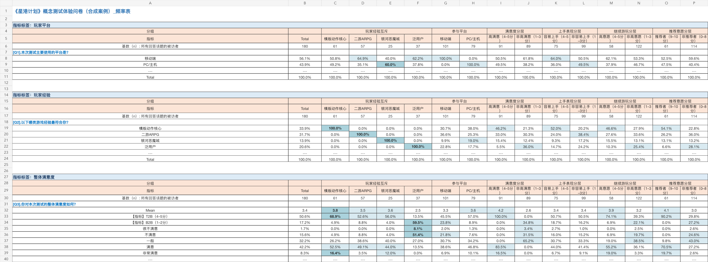

# 合成游戏体验问卷案例

本案例使用 180 名完全合成、已去标识化的玩家数据，演示从问卷结构和答卷到研究交叉数表的完整流程。案例不连接任何真实问卷星账号，也不包含真实用户信息。

## 覆盖能力

- 原生分组：玩家经验、参与平台
- 指标分层：满意度、上手表现、继续游玩、推荐意愿
- 题型：单选、五点评分、多选、矩阵、NPS、排序、开放题
- 指标：Mean、T2B、B2B、NPS、入选率、平均名次
- 显著性：同一分组族内的比例检验和 Welch 检验
- 输出：Index 超链接、频率表、显著性检验、说明、变量映射、数据质量
- 排序：本案例使用默认模式，保留问卷原始选项顺序

## 案例文件

- `source/`：合成问卷结构、180 份答卷和来源回执
- `project-config.json`：原生分组、指标分层、T2B/B2B、NPS 与列顺序配置
- `expectations.json`：独立样本量、题目基数和关键单元格预期值
- `outputs/synthetic-game-survey-crosstabs.xlsx`：最终可下载的 Excel 案例
- `validation-receipt.json`：分析 JSON 的结构、统计与预期值校验
- `workbook-verification.json`：工作簿页签、标题和公式错误检查
- `index-link-verification.json`：20 个 Index 链接与对应蓝色题目标题行的逐项校验
- `previews/`：Index、频率表和显著性表预览



## 合成结果摘要

- 整体满意度 Mean 为 3.4，T2B 为 50.6%。
- 横版动作核心玩家的满意度 Mean 为 3.8，T2B 为 68.9%，显著高于同族其他经验组。
- 总体 NPS 为 +11，横版动作核心玩家为 +44。
- 战斗手感总体选择率为 45.0%，横版动作核心玩家为 77.0%。
- 新手引导进入优化前三项的比例为 82.8%。

以上结果由合成规则刻意制造，仅用于展示统计、格式和显著性标记，不代表任何真实产品结论。

## 重新运行

在 Codex 中加载电子表格运行环境后，将对应路径传入以下环境变量：

```bash
WJX_PYTHON_PATH=/path/to/python3 \
WJX_NODE_PATH=/path/to/node \
WJX_NODE_MODULES=/path/to/node_modules \
python3 examples/synthetic-game-survey/run_demo.py --regenerate-source
```

生成文件默认写入 `examples/synthetic-game-survey/build/`。维护者确认结果后可增加 `--publish`，更新仓库内的 Excel、预览图和校验回执。

合成数据固定使用种子 `8122026`。重新生成后，所有基数和关键结果应与 `expectations.json` 一致。
